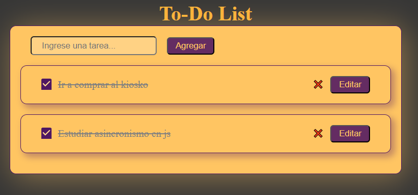

# TO-DO List

Esta es una aplicación To-Do list creada con vite, react js, sass, json-server y sweetAlert2.

## Instalación y ejecución del proyecto.

### 1. Instalar las dependencias del proyecto:

```
npm install
```

### 2. Ejecutar el entorno de desarrollo.

```
npm run dev
```

### 3. Ejecutar la api de json-sever.

```
npm run start:server
```

## Previsualización del proyecto.

1. Sin tareas en la lista:


2. Con tareas pendientes:


3. Tareas completadas.



4. Panel de edición de tareas.


